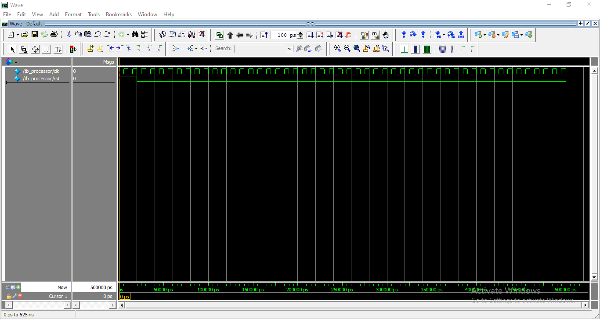
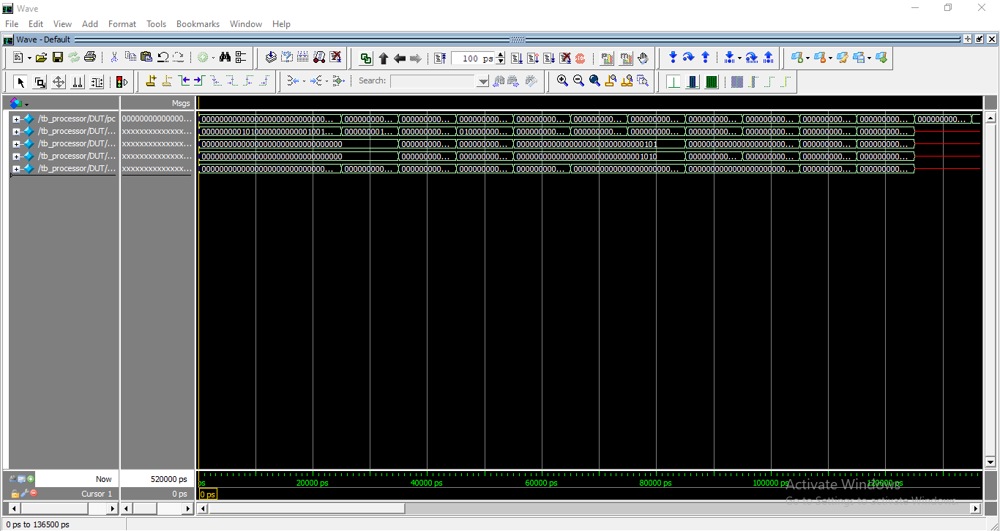
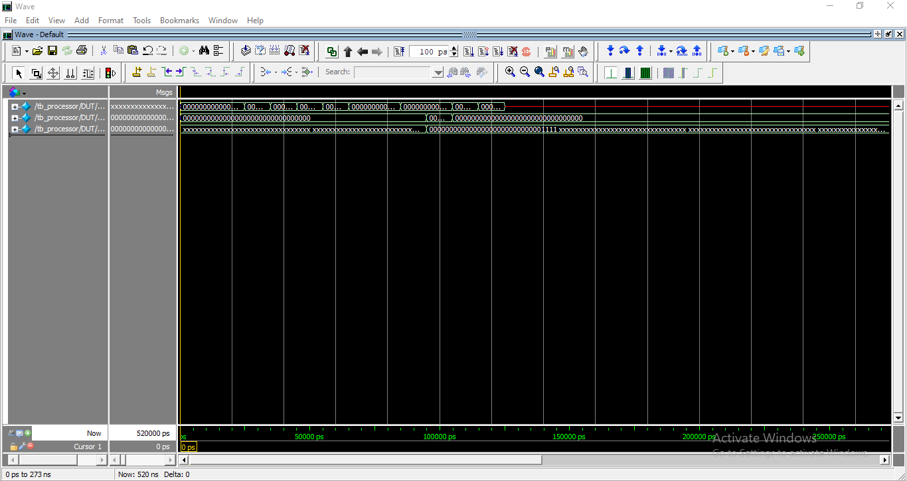
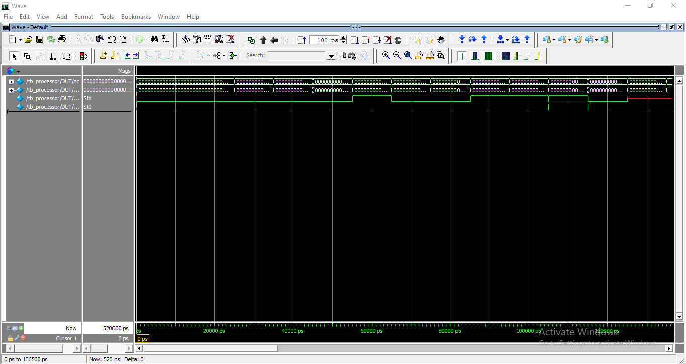

# 32-bit RISC-V Processor (RV32I) | Verilog | SystemVerilog | ModelSim | RTL Design

## Overview

This project implements a **32-bit Single-Cycle RISC-V Processor** in Verilog HDL based on the **RV32I Instruction Set Architecture (ISA)**. The processor executes instructions in a single clock cycle and includes fundamental components of a modern CPU such as the Program Counter (PC), Instruction Memory, Register File, ALU, Control Unit, Immediate Generator, Data Memory, and Branch Logic.

The design has been functionally verified using **SystemVerilog testbenches** and simulated using **ModelSim Intel FPGA Edition**.

---

## Features

* 32-bit Single-Cycle RISC-V Architecture
* RV32I Instruction Subset Implementation
* Program Counter (PC)
* Instruction Memory
* Register File (32 × 32-bit Registers)
* Arithmetic Logic Unit (ALU)
* Control Unit
* Immediate Generator
* Data Memory
* Branch Decision Logic
* SystemVerilog Testbench
* ModelSim Simulation and Waveform Verification

---

## Supported Instructions

### Arithmetic Instructions

* ADD
* SUB
* AND
* OR
* XOR

### Immediate Instructions

* ADDI
* ANDI
* ORI

### Memory Instructions

* LW
* SW

### Branch Instructions

* BEQ

---

## Processor Architecture

```
Program Counter
       |
       v
Instruction Memory
       |
       v
Control Unit -------> Immediate Generator
       |
       v
Register File
       |
       v
      ALU
       |
       +-------> Data Memory
       |
       v
   Write Back
       |
       v
 Register File
```

---

## Project Directory Structure

```
RISCV_32bit_Processor
│
├── README.md
│
├── RTL
│   ├── processor_top.v
│   ├── pc.v
│   ├── instruction_memory.v
│   ├── register_file.v
│   ├── alu.v
│   ├── control_unit.v
│   ├── immediate_generator.v
│   ├── data_memory.v
│   └── branch_unit.v
│
├── Verification
│   ├── tb_processor.sv
│   └── test_program.mem
│
├── Simulation
│   ├── run.do
│   ├── arithmetic.do
│   ├── memory.do
│   ├── branch.do
│   └── program.do
│
├── Waveforms
│   ├── arithmetic.png
│   ├── memory.png
│   ├── branch.png
│   └── program.png
│
├── Documentation
│   └── Project_Report.pdf
│
└── LICENSE
```

---

## Test Program

```assembly
addi x1, x0, 5
addi x2, x0, 10

add  x3, x1, x2
sub  x4, x2, x1
and  x5, x1, x2
or   x6, x1, x2
xor  x7, x1, x2

sw   x3, 0(x0)
lw   x8, 0(x0)

beq  x8, x3, LABEL

addi x9, x0, 1

LABEL:
addi x10, x0, 2
```

---

## Simulation Results

### Program Execution Waveform



---

### Arithmetic Instruction Execution



---

### Memory Read and Write Operations



---

### Branch Instruction Execution



---


```
x1  = 5
x2  = 10
x3  = 15
x4  = 5
x5  = 0
x6  = 15
x7  = 15
x8  = 15
x9  = 0
x10 = 2
```

---

## Verification Methodology

* Functional simulation using ModelSim Intel FPGA Edition
* SystemVerilog self-checking testbench
* Register value verification
* ALU operation verification
* Memory read/write verification
* Branch operation verification
* Waveform analysis

---

## Applications

* Computer Architecture Education
* Processor Design Learning
* RTL Design Practice
* ASIC Design and Verification Projects
* FPGA-Based CPU Development
* Digital System Design Research

---

## Tools Used

* Verilog HDL
* SystemVerilog
* ModelSim Intel FPGA Edition
* Git
* GitHub

---

## Future Enhancements

* Complete RV32I Instruction Set Support
* JAL and JALR Instructions
* BNE, BLT, and BGE Instructions
* LUI and AUIPC Instructions
* Pipeline Implementation
* Hazard Detection Unit
* Forwarding Unit
* Cache Memory Integration
* FPGA Synthesis and Implementation

---

## Documentation

📄 [Project Report](Documentation/RISCV_32bit_Processor.pdf)

---

## Author

**Kishore Vanapalli**

Bachelor of Technology (B.Tech) in Electronics and Communication Engineering (ECE)
Pragati Engineering College

Aspiring VLSI Physical Design Engineer with a strong foundation in Digital Electronics, Verilog HDL, RTL Design, and Computer Architecture. Passionate about semiconductor design and currently building expertise in RTL-to-GDSII Physical Design flow, including Static Timing Analysis (STA), Floorplanning, Placement, Clock Tree Synthesis (CTS), Routing, and Physical Verification.

Areas of Interest:
• Physical Design (RTL-to-GDSII)
• Static Timing Analysis (STA)
• Digital VLSI Design
• RTL Design and Verification
• ASIC Backend Design
• Semiconductor Design and Verification
